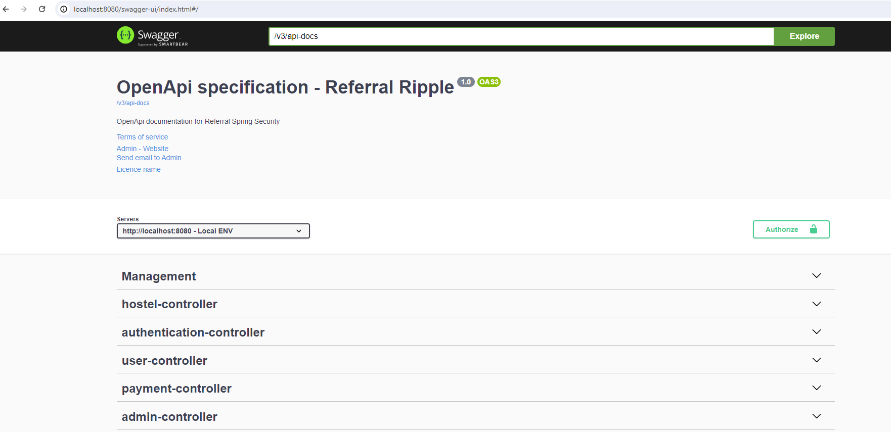
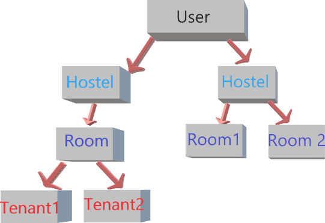

# Contracker-API
Contracker application created for tracking the CIVIL contract work. It contains the various entities like Project, Site, Company, Equipement, etc.

This application will have two default users like Admin & Manager. It also provides the API documentation. Kindly visit the <a href="http://localhost:8080/swagger-ui/index.html">Open API Document</a> once application is up and running.



## High level hierarchy of Hostel Management




MySQL user should be created with the credentials of root/root. If you have your own credentials, it needs to be updated in **application.yml** file.
```dtd
spring:
  datasource:
    url: jdbc:mysql://localhost:3306/equipment
    username: root
    password: root
    driver-class-name: com.mysql.cj.jdbc.Driver
```
You should create the database with the name of equipment(it can be any name) in MySQL environment. if you want to create with different name, it needs to be updated in the above url property.

## MySQL command to create database
```dtd
create database equipment
```
verify with the below command that the equipment database has been created or not
```dtd
show databases
```